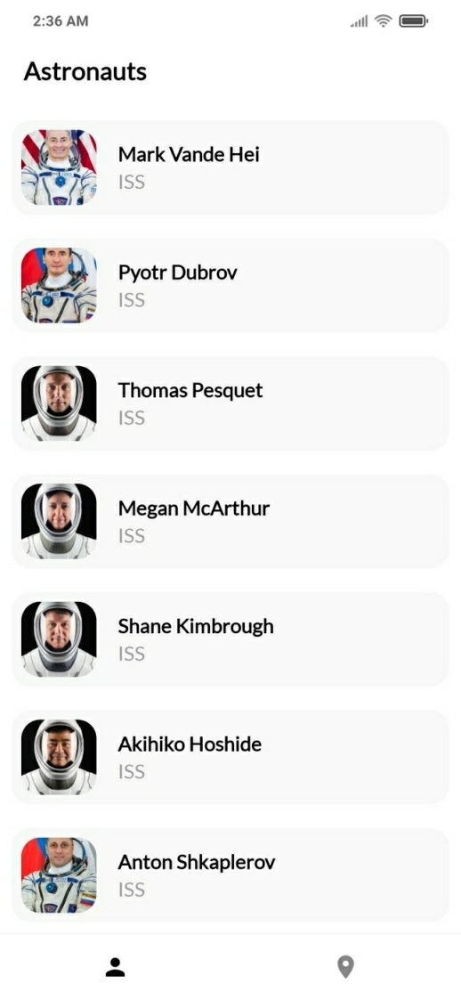
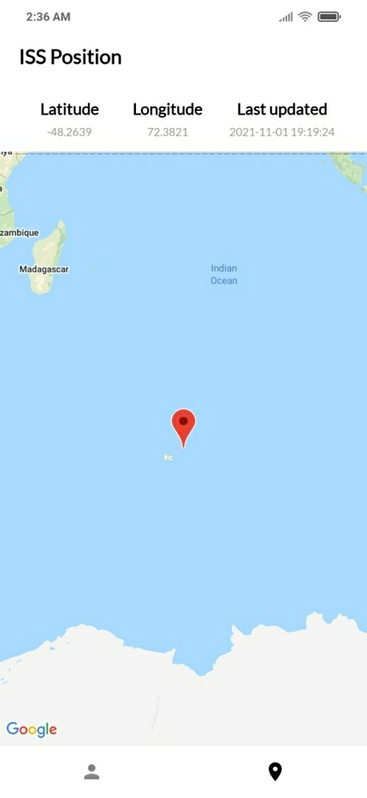
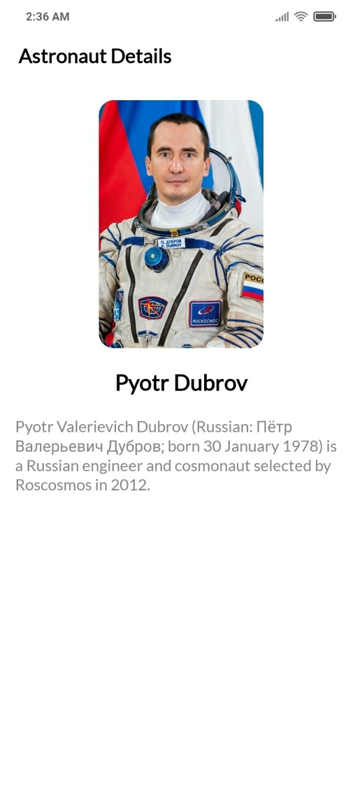

# Astro

A demo app, showing the current list of people in the space, using Jetpack compose, and Koin, based on modern Android tech-stacks and MVVM architecture. Fecthing data from the network and integrating persisted data in the database.

## Screenshots

  
&nbsp;
  
&nbsp;
  

## Tech & Open-source libraries used
- [Kotlin](https://kotlinlang.org/) + [Coroutines](https://github.com/Kotlin/kotlinx.coroutines)
- [Koin](https://insert-koin.io/) for dependency injection.
- Jetpack
   - Compose - A modern toolkit for building native Android UI.
   - ViewModel - storing and managing UI-related data in a lifecycle conscious way.
- Architecture
   - MVVM Architecture (Declarative View - ViewModel - Model)
- [Ktor](https://ktor.io/docs/http-client-engines.html#jvm-android) for making http network request.
- [SQLDelight](https://cashapp.github.io/sqldelight/) for generating typesafe kotlin APIs for SQL statements.
- [Google Maps](https://developers.google.com/maps/documentation/android-sdk/overview/) for showing current location of ISS.

It uses api used in [People in Space](https://github.com/joreilly/PeopleInSpace) to show list of people in space and current position of the ISS.

## Google Maps SDK

For google map to work, add API key in the `local.properties` file as below
>  MAPS_API_KEY=API_KEY

Read [documentation](https://developers.google.com/maps/documentation/android-sdk/get-api-key) to generate a key.

